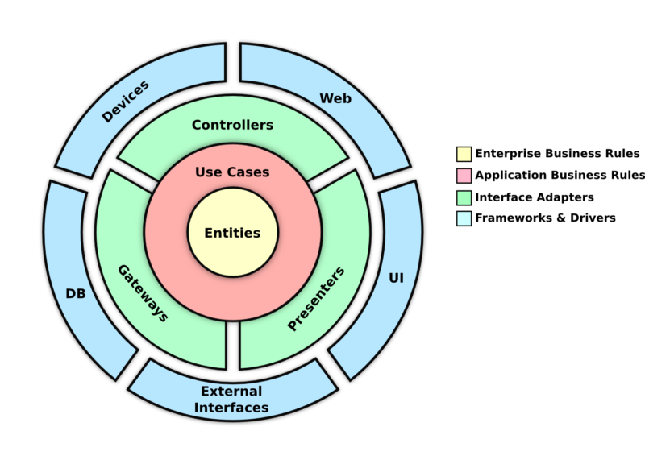
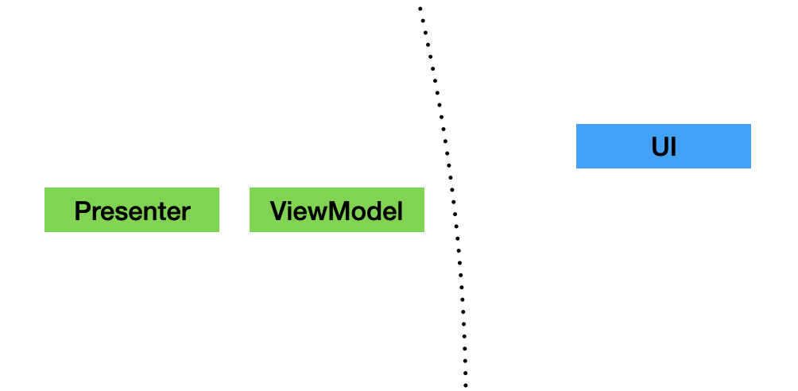

author: ACME Software
summary: Introduction to Clean Framework
id: clean-framework-introduction
tags: introduction clean framework
categories: ACME Softare Codelabs
environments: Web
status: Active
feedback link: https://github.com/MattHamburger/clean_framework/issues

# Introduction to Clean Framework
## Overview

Duration: 0:10:00

Clean Framework is a toolkit of classes and implementations that help any developer create a layered architecture on any app, following the principles of Clean Architecture from Uncle Bob (Robert Martin).

### The Layers

To understand the components, first we have to talk about the layers, which are just a way to group your code to avoid interdependencies and to separate concerns.

The following diagram explains how the Clean Architecture proposes the implementation of the layers.



The idea of layering the architecture to separate the domain logic from the implementation details is not recent, and some other approaches have also been proposed (like the Hexagonal Architecture). Bob Martin took good ideas from the existing proposals, so some of the terms may seem familiar.

### Entities Layer

The core of your app should exist within this layer. Here we have Entity instances that hold the state of all your features. These entities are immutable and should be free of any external code, they should not care about databases, UI, or services. If you are familiar with Domain Driven Design, this is considered your Domain data.

### Use Cases Layer

The Use Case is an object that handles the data in the Entities and redirects the flows of data. Use Cases will hold most of the business logic of your features. 

Use Cases handle two classes, Input and Output, which move data inside or outside respectively, they are very similar to DDD Events. The next layer can only use these components to send and receive data from the Entities. Since they are simple PODOs (Plain Old Dart Objects), they are completely agnostic from the implementation of the outside layer, and this means the Use Case will usually interact with any type of object without worrying about the details.

To interact with the Outputs and Inputs, Use Cases use requests and filters, and these interactions can be synchronous or subscriptions.

### Adapters Layer

The goal of this layer is to translate the Inputs and Outputs from the Use Case into more specific messages for specific destinations. These components have a similar function than the BDD Adapter. We have to main components, the Presenter and the Gateway

#### Presenter

It's job is to translate Outputs into ViewModels, which are contain data and behavior (in the form of callbacks). This class will hold most of your UI logic that is not business related, like navigation.

Presenters will interact with providers of Use Cases to subscribe to a specific Output, so when that output gets updated, we can schedule a refresh on the UI side. Once the Presenter receives the updated Output, it will create a new View Model to be processed by the UI.

#### Gateway

When you need external data from sources like REST servers, databases, hardware, cache, etc. Use Cases will send requests with an specific Output. This message will be listened by a Gateway, which translates the Output data into a request that can be processed by the next layer.

There are two types of Gateway, depending on how you need the response to be delivered. The base Gateway class handles requests and waits for a response on the same interaction, blocking the execution until a response or an error is received.

The other type is the WatcherGateway, which will create a subscription. Once the result is received and sent back to the UseCase, it will keep listening for subsequent responses, which are sent to the Use Case through the Input listener.

### External Interfaces Layer

This is where code from libraries and dependencies interacts with your features. Waits for Requests to happen and then process them depending on its type. Clean Framework include some ready-to-use default implementations to work with Firebase, GraphQL and REST services.

The UI layer is considered a type of External Interface layer since it also relies on messages to an adapter (the Presenter) to send and receive state changes from the entities.


## Setup

Duration: 0:05:00

To start using the Clean Framework components, you need to add the library on the pubspec.yaml of the project. Use the latest version available.

```yaml
dependencies:
    clean_framework: ^1.1.0
```

### Project Structure

We suggest you organize your app into Features, with the assumption that features don't depend on each other. The goal should be to be able to delete a feature completely and don't break any code.

Each feature could be organized in this way:

```
lib
    providers_loader.dart
    features
        my_new_feature
            domain
                my_new_feature_usecase.dart
                my_new_feature_entity.dart
                my_new_feature_outputs.dart
                my_new_feature_inputs.
            presentation
                my_new_feature_presenter.dart
                my_new_feature_view_model.dart
                my_new_feature_ui.dart
            external_interfaces
                my_new_feature_gateway.dart
```

Notice that the name of the feature is a prefix for all the files inside. We prefer this naming convention so they are easier to idenfiy on searches, but you are free to follow any convention that suits your need.

The folder structure is also a suggestion, you can add multiple layers if the feature begins to grow and have multiple screens and interactions.

### The Providers

Use Cases, Gateways and External Interfaces are instances of classes that are not Flutter Widgets, so they are not dependant on the Flutter Context. To have access to them, you can "publish" them using the Providers pattern. 

If you notice on the files list shown above, outside the features folder we have a file where we list all the providers used on the app. For large projects this is probably not the best idea, since this file can be long and bloated, so probably splitting the providers by feature could work better.

This is an example on how this file can be coded:

```dart
final myNewFeatureUseCaseProvider =
    UseCaseProvider<MyNewFeatureEntity, MyNewFeatureUseCase>(
  (_) => LastLoginUseCase(),
);

final myNewFeatureGatewayProvider = GatewayProvider<MyNewFeatureGateway>(
  (_) => MyNewFeatureGateway(),
);

void loadProviders() {
  myNewFeatureUseCaseProvider.getUseCaseFromContext(providersContext);

  MyNewFeatureGatewayProvider.getGateway(providersContext);

  restExternalInterface.getExternalInterface(providersContext);
}
```

Clean Framework uses Riverpod for the Providers behavior, so you can understand why the providers are global instances. For anyone not familiar to how Riverpod works, this might seem innapropiate, specially comming from a strict OO formation. Justifying why this is useful and desirable, please refer to the [Riverpod documentation](https://riverpod.dev/docs/concepts/providers), since the creator already did a great job explaining this approach.

Providers create instances lazyly, but some of the listeners need to be connected before use cases make any request. That is why we use a global function to "touch" all gateway and external interfaces providers to ensure they are created when the app starts.

The last consideration is to remember to use the function on the main function:

```dart
void main() {
  loadProviders();
  runApp(MyApp());
}
```

<aside class="positive">
While working on this codelab, it won't be necessary to have this file from the beginning, you will see a box like this one to let you know when it will be needed.
</aside>

## The UI Layer: UI, Presenter and View Model

Duration: 0:15:00

Lets discuss in more detail the components of the UI Layer



As mentioned on the previous topic, the UI component lives on the most external layer of the architecture. It means that it is related to specific libraries that conform the frontend of the application, in our case, the Flutter widgets libraries.

When building an app using the Clean Framework classes, we try to separate as much as possible any code that is not related to pure UI logic and put that on the Presenter (to send and receive data from internal layers) and the Use Case (the normal location for business logic).

UI is a class that behaves like a Stateless Widget. It will be very rare that a Stateful Widget is needed, since the state usage for important data breaks the layer rules. Try to always think on ways the UI widgets without the need for Stateful Widgets.

All UI implementations require at least one View Model to fetch data from the entities. This data comes from Use Case Outputs, which Presenters receive and translate as needed.

The feature you code can be expresed into multiple screens presented to the user, and even include small widgets that are inserted in other screens. These are your entry points to the feature, and as such, will require for the UI to listen to the state changes of the feature's Use Case through its Outputs. In other words, Use Cases can have multiple Outputs, that can have relationships with many View Models through the Presenters.

View Models are immutable classes, almost pure PODO's (Plain Old Dart Objects). We try to make them as lean as possible, because its only responsibility is the passing of digested data fields into the UI object.

They tend to have only Strings. This is intentional since the Presenter has the responsibility of any formating and parsing done to the data.

Finally, the Presenters purpose is to connect and listen to Use Case Providers to interact with the Use Case instance and pass messages for user actions done on the UI (through callbacks on the View Model) and also to trigger rebuilds on the UI when the state changes causes a new Output to be generated. This will be explained in detail on the following sessions, so for now just asume the Presenters associate with only one type of Output.

The most important job of the Presenter is to translate an Output instance and create a new View Model everytime the Output is received. 

### Testing and Coding the UI Layer

After a feature folder is created, any developer will probably try to start adding Flutter Widgets to build up the code requirements. This framework is flexible enough to allow you to start coding components that don't require to have any access or even knowledge of any possible dependency (databases, services, cache, etc), because those concerns belong to other layers.

The simplest way to start working on a new feature is to first decide how many UI elements will be required to complete the implementation of the feature. For the sake of simplicity we are going to considering only one widget for the single screen of the new feature.

<aside class="positive">
While working on this codelab, we will be creating the code by using TDD so we can focus on stablishing the desired outcome before explaining the code that produces it.
</aside>

### The feature requirements

We are going to code a very simple feature which can be explained in a few Gherkin scenarios:


```gherkin
Given I have navigated to the Add Machine feature
Then I will see the Add Machine screen
And the total shown will be 0.

Given I opened the Add Machine feature
When I write a number on the number field
And I press the "Add" button
Then the total shown will be the entered number.

Given I have entered a number on the Add Machine feature
When I write another number and press "Add"
Then the total shown will be the sum of both numbers.

Given I have added one or more numbers on the Add Machine feature
When I navigate away and open the feature again
Then the total shown is 0.
```

And this is the design of the page, which we have as reference, but the scope of the codelab won't be to focus on completing the code to reflect exactly the appearance, it will be up to you to finish the implementation.


<aside class="negative">
These are not the only scenarios that should exist, since we are not covering possible error scenarios, like when the user adds no input at all, or tries to write something that is not a number. We leave the gaps of behavior out to be covered as an additional exercise for the developers.
</aside>

### The UI component test

UI components are extensions of Flutter Widgets, so this means the we have to use a Widget Tester. Our goal is to confirm that the data is retrieved correctly from the view model.

This is how our basic test looks like:

#### test/features/add_machine/presentation/add_machine_ui_test.dart
```dart
void main() {
    uiTest(
        'AddMachineUI unit test',
        context: ProvidersContext(),
        builder: () => AddMachineUI(),
        verify: (tester) async {

            expect(find.text('Add Machine'), findsOneWidget);

            final sumTotalWidget = find.byKey(Key('SumTotalWidget'));
            expect(sumTotalWidget, findsOneWidget);

            expect(find.descendant(of: sumTotalWidget, matching: find.text('0')), findsOneWidget);

        },
    );
}
```

After creating the initial blank project (using 'flutter create' for instance), you can add this test under the suggested path (features/add_machine/presentation).

<aside class="negative">
Be aware that TDD rules should cause the developer to not write more code than what is needed in order to make the test pass, but recreating the actual process will be lengthy for this codelab. We are oversimplifying the process here.
</aside>

Now, to explain the code:
* Notice how we are using our own "tester" component, the uiTest function. This helper uses a Widget tester internally, but also helps on the setup of a MaterialApp with a proper provider context. The context allows the override of already defined providers if needed.

* The builder creates an instance of a class that extends from the Clean Framework UI abstract class.

* Verify is a function parameter to attach all the expects and actions done normally on widget tests.

The test is confirming that the first Gherkin scenario happens correctly, but of course the test cannot pass until we have coded the actual UI class. The first piece of code we have to provide is precisely this UI implementation.

But in practice, we not only need that. UI is coupled to a valid ViewModel, which gets translated from a specific Output inside a Presenter. So lets create the minimal code on these classes to make the test pass:

#### lib/features/add_machine/presentation/add_machine_ui.dart
```dart
class AddMachineUI extends UI<AddMachineViewModel> {
  AddMachineUI({required PresenterCreator<AddMachineViewModel> create})
      : super(create: create);

  @override
  Widget build(BuildContext context, AddMachineViewModel viewModel) {
    return Column(children: [
      Text('Add Machine'),
      Container(
        key: Key('SumTotalWidget'),
        child: Text(viewModel.total),
      ),
    ]);
  }

  @override
  create(PresenterBuilder<AddMachineViewModel> builder) {
    throw UnimplementedError();
  }
}
```

#### lib/features/add_machine/presentation/add_machine_view_model.dart
```dart
class AddMachineViewModel extends ViewModel {
  final String total;

  AddMachineViewModel({required this.total});

  @override
  List<Object?> get props => [total];
}
```

Let's review the code so far:

* The UI class specifies by generics the usage of a AddMachineViewModel. This way the class can have access to any field of the model.

* A constructor is provided to accept a creator function. This is normally not needed. The "normal" implementation instanciates the proper presenter on the create override. But to make the test pass we can have a presenter that doesn't use a Use Case provider, but builds a static view model instead. This is useful for unit tests that use fake presenters.

* Since the presenter has a mocked behavior, the actual class is defined on the test file, and the create override is left as is (it will never be called on execution).


Now let's look at the necessary changes to the test itself:

#### test/features/add_machine/presentation/add_machine_ui_test.dart
```dart
void main() {
  uiTest(
    'AddMachineUI unit test',
    context: ProvidersContext(),
    builder: () => AddMachineUI(
      create: (builder) => AddMachinePresenter(builder: builder),
    ),
    verify: (tester) async {
      expect(find.text('Add Machine'), findsOneWidget);

      final sumTotalWidget = find.byKey(Key('SumTotalWidget'));
      expect(sumTotalWidget, findsOneWidget);

      expect(find.descendant(of: sumTotalWidget, matching: find.text('0')),
          findsOneWidget);
    },
  );
}

class AddMachinePresenter
    extends Presenter<AddMachineViewModel, AddMachineUIOutput, UseCase> {
  AddMachinePresenter({
    required PresenterBuilder<AddMachineViewModel> builder,
  }) : super(provider: addMachineUseCaseProvider, builder: builder);

  @override
  AddMachineViewModel createViewModel(UseCase<Entity> useCase, output) =>
      AddMachineViewModel(total: output.total.toString());

  AddMachineUIOutput subscribe(_) => AddMachineUIOutput(total: 0);
}

class AddMachineUIOutput extends Output {
  final int total;

  AddMachineUIOutput({required this.total});

  @override
  List<Object?> get props => [total];
}

final addMachineUseCaseProvider = UseCaseProvider((_) => UseCaseFake());

```

The Presenter, Output and UseCaseProvider are using as much fake data as possible to control the outcome of the test.

<aside class="positive">
We use to write any mocks and fakes in the test file that uses them, and try to not share them, since scenarios change over time and trying to refactor all the helpers and derivates can be a complex and time-consuming task. Projects benefit more from fast unit tests that can be changed easily over time. If this doesn't fit your company policy, feel free to adapt the implementation to your needs.
</aside>

### A complete Presenter

Now lets evolve our current code so we can test the second scenario. This is the test for it:

```dart
/// Given I opened the Add Machine feature
  /// When I write a number on the number field
  /// And I press the "Add" button
  /// Then the total shown will be the entered number.
  uiTest(
    'AddMachineUI unit test - Scenario 2',
    context: ProvidersContext(),
    builder: () => AddMachineUI(
      create: (builder) => AddMachinePresenter(builder: builder),
    ),
    verify: (tester) async {
      final numberField = find.byKey(Key('NumberField'));
      expect(numberField, findsOneWidget);

      await tester.enterText(numberField, '15');

      final addButton = find.byKey(Key('AddButton'));
      expect(addButton, findsOneWidget);

      await tester.tap(addButton);

      final sumTotalWidget = find.byKey(Key('SumTotalWidget'));
      expect(sumTotalWidget, findsOneWidget);

      expect(find.descendant(of: sumTotalWidget, matching: find.text('15')),
          findsOneWidget);
    },
  );
```

<aside class="positive">
There are opportunities to refactor the two tests, since we are repeating usages of finders, but it would be hard to understand the code on the codelab, we will have to constantly be looking at all the tests to understand the code. We leave that effort to you.
</aside>

To make this test work, we will need to first move the Presenter code into its corresponding place inside the production features code, complete the implementation, and make the test use a fake Use Case that publishes a single static Output.

#### lib/features/add_machine/presentation/add_machine_presenter.dart
```dart
class AddMachinePresenter
    extends Presenter<AddMachineViewModel, AddMachineUIOutput, UseCase> {
  AddMachinePresenter({
    required UseCaseProvider provider,
    required PresenterBuilder<AddMachineViewModel> builder,
  }) : super(provider: provider, builder: builder);

  @override
  AddMachineViewModel createViewModel(useCase, output) => AddMachineViewModel(
      total: output.total.toString(),
      onAddNumber: (number) => _onAddNumber(useCase, number));

  void _onAddNumber(useCase, String number) {
    useCase.setInput<AddMachineAddNumberInput>(
        AddMachineAddNumberInput(int.parse(number)));
  }
}
```

#### lib/features/add_machine/presentation/add_machine_view_model.dart
```dart
class AddMachineViewModel extends ViewModel {
  final String total;
  final ValueChanged<String> onAddNumber;

  AddMachineViewModel({required this.total, required this.onAddNumber});

  @override
  List<Object?> get props => [total];
}
```

#### lib/features/add_machine/domain/add_machine_ui_output.dart
```dart
class AddMachineUIOutput extends Output {
  final int total;

  AddMachineUIOutput({required this.total});

  @override
  List<Object?> get props => [total];
}
```

#### lib/features/add_machine/domain/add_machine_add_number_input.dart
```dart
class AddMachineAddNumberInput extends Input {
  final int number;

  AddMachineAddNumberInput(this.number);
}

class AddMachineViewModel extends ViewModel {
  final String total;
  final ValueChanged<String> onAddNumber;

  AddMachineViewModel({required this.total, required this.onAddNumber});

  @override
  List<Object?> get props => [total];
}
```


About the code so far:

* The Presenter got rid of the "subscribe" override since we will depend now entirely on an AddMachineUIOutput object from a provided use case.

* When sending messages to the use case, we can either do it through a custom method or by using an Input, as we are doing here. Using the input helps us to not have to declare a custom Use Case, to make the test pass with as little code as possible.

* The View Model has a new attribute, the callback that we will use to link the user action on the UI with an Input that is sent to the Use Case. ***Notice how callbacks are not considered part of the fieds used for equality comparisons.***

* Both input and output classes now are inside the proper folder. UI components can import from domain files, and at this point, only the Presenter and test mocks create instances of them.

We have to make fixes on the UI to add the new widgets:

#### lib/features/add_machine/presentation/add_machine_ui.dart
```dart
class AddMachineUI extends UI<AddMachineViewModel> {
  final UseCaseProvider provider;

  AddMachineUI({required this.provider});

  @override
  Widget build(BuildContext context, AddMachineViewModel viewModel) {
    final fieldController = TextEditingController();
    return Scaffold(
      body: Column(children: [
        Text('Add Machine'),
        Container(
          key: Key('SumTotalWidget'),
          child: Text(viewModel.total),
        ),
        TextFormField(
          key: Key('NumberField'),
          controller: fieldController,
          decoration: const InputDecoration(
              border: UnderlineInputBorder(), labelText: 'Write a number'),
        ),
        ElevatedButton(
          key: Key('AddButton'),
          onPressed: () => viewModel.onAddNumber(fieldController.value.text),
          child: Text('Add'),
        ),
      ]),
    );
  }

  @override
  create(PresenterBuilder<AddMachineViewModel> builder) =>
      AddMachinePresenter(provider: provider, builder: builder);
}
```

* Notice that now the View Model has a callback field, which the UI calls to send the current number text to the Presenter. This is the goal of the code separation, we delegate the parsing and validation of the field value to the Presenter, which in turn can rely on the Use Case for complex validations.

* We are intentionally creating a TextEditingController inside a build method. This is not what Flutter developers normally do, since any rebuild will override the current value, but for this simple feature this is enough. If this becomes an issue, then we suggest creating a wrapper widget around your field, with a state that handles the controller, just remember to avoid using the state for anything else.

Now that we have a full presenter implementation, the test can stop relying on the test presenter we coded previously, and change the mocks, now we need to mock the Use Case, as follows:

#### test/features/add_machine/presentation/add_machine_ui_test.dart
```dart
void main() {
  uiTest(
    'AddMachineUI unit test - Scenario 2',
    context: ProvidersContext(),
    builder: () => AddMachineUI(provider: addMachineUseCaseProvider),
    verify: (tester) async {
      final numberField = find.byKey(Key('NumberField'));
      expect(numberField, findsOneWidget);

      await tester.enterText(numberField, '15');

      final addButton = find.byKey(Key('AddButton'));
      expect(addButton, findsOneWidget);

      await tester.tap(addButton);
      await tester.pumpAndSettle();

      final sumTotalWidget = find.byKey(Key('SumTotalWidget'));
      expect(sumTotalWidget, findsOneWidget);

      expect(find.descendant(of: sumTotalWidget, matching: find.text('15')),
          findsOneWidget);
    },
  );
}

final addMachineUseCaseProvider = UseCaseProvider((_) => StaticUseCase([
      AddMachineUIOutput(total: 0),
      AddMachineUIOutput(total: 15),
    ]));
    
class StaticUseCase extends UseCase<EmptyEntity> {
  static int _index = 0;
  final List<Output> outputs;

  StaticUseCase(this.outputs) : super(entity: EmptyEntity());

  @override
  void setInput<I extends Input>(I input) {
    _index++;
    entity = EmptyEntity();
  }

  @override
  O getOutput<O extends Output>() {
    return outputs[_index] as O;
  }
}

class EmptyEntity extends Entity {
  @override
  List<Object?> get props => [];
}

```

<aside class="positive">
Remember that as part of the TDD methodology, you will be constantly refactoring and updating the tests the more production code you complete, at this point you can see that the UseCaseFake is basically a minimal functioning Use Case. This is done intentionally to exemplify how fakes can be used to avoid writing production code before it's actually needed. For a normal real-case project, this is probably a step you can skip.
</aside>

Hopefuly by now you can appreciate the capacity of the Clean Framework components to help developers work with the UI layer without the need to first finish the Domain Layer code. You can even work in paralel with another developer that is doing it, while also having a high coverage on your code.

It has to be noted that this is very helpful to create MVP builds and have a working prototype that can be reviewed by stakeholders and QA teams, saving the development team a lot of headaches, since the feedback can be received sooner.


## The Domain Layer: Entity, Use Case and the interactions with Outputs and Inputs

Duration: 00:10:00

Congratulations, at this point we are ready to start exploring the Domain Layer, the heart of anything important for the project.


### Entity

Let's start by understanding the Entities. If you are familiar with Domain Driven Design (DDD), you already know how important are the Domain components to an app. When the design is robust, there is a zero chance that the state of the app failes due to validation or null errors. Domain models have strict rules so it is very hard to create instances with inconsistent states.

The sum of all your Entities is the state of the whole feature. This state will be kept alive as long as its Use Case exists. Since we create it when the app is executed (using a provider), this reference is alive until the app is removed from memory.

So it is important to understand that this state needs initial values and rules governing how those values chage. When writing an Entity, try to follow these rules:

1. Entities don't depend on other files or libraries except for the clean framework import. This is the most central layer, so it should not need anything, not even from other features. Shared enums are even problematic, since feature requirements could change, forcing you to refactor the affected features. 

1. Attributes should be final and have initial values on construction. Some of them could be required values, inserted at the time the UseCase is created as well (explained in the following section).

1. Use proper data types instead of relaying on parsers. For example, use DateTime instead of a String for a date attribute. You can parse the date in Presenters and Gateways.

1. It is OK to create a hierarchy of entities, but keep a single ancestor that the Use Case can create easily. Composition is much better than inheritance. Functional constructs like Either and Unions are useful here as well.

1. Add generators like **copyWith** or **merge** to create instances based on current values. This simplifies the Use Case code.

It is OK to add methods to validate the consistency of the data. For example:

```dart

class AccountEntity extends Entity{
  final bool isRegistered;
  final UserNameEntity userName;

  AccountEntity({required this.isRegistered, this.userName});
}

class UserNameEntity extends Entity{
  final String firstName;
  final String lastName;

  UserNameEntity({required this.firstName, this.lastName}) : assert(firstName.isNotEmpty() && lastName.isNotEmpty);

  String get fullName => firstName + ' ' + lastName;
}
```

See how it is virtually impossible to create an inconsistent user name with null or empty first and last name, and we have a dynamic getter that builds the full name.

This has two main advantages:

1. Developers will not write wrong code around this entity fields, since they have syntax errors or exceptions that are easy to catch while writing tests and coding.

2. The custom logic to compose fields is delegated to the Entity and is not floating around next other business logic from the Use Case, making the Use Case code easier to read.

Try to delegate similar helper methods to the Entity, where they only rely on the data, such as form validations, math calculations, derivatives, etc.

<aside class="negative">
Be careful to not add logic that doesn't belong to the Entities, or you will be bleeding behavior that should belong to the Use Case. Remember the layers rules, and think if your method is still valuable if the rest of the layers change or are even removed.
</aside>

### Use Case

Use Cases live outside the Entities, on its own layer. Use Cases will create and manipulate Entities internally, while transfering data from Inputs and into Outputs. Lets look at one simple example to understand the class:

```dart
class MyUseCase extends UseCase<MyEntity> {
  MyUseCase()
      : super(entity: MyEntity(), outputFilters: {
          MyUIOutput: (MyEntity e) => MyUIOutput(data: e.data),
        }, inputFilters: {
          MyInput: (MyInput i, MyEntity e) => e.copyWith(data: i.data),
        });
}
```

A typical Use Case will need to create an Entity. The output filters attribute lets you set up a list of possible "channels" that Presenters can use to subscribe to.

Here, MyUseCase has only one output, so the Presenter only needs to listen to MyUIOutput instances, which will be generated when the Presenter is created and any time the Entity **data** field changes. 

Notice that the filter is a Map of the type of the Output and a function that receives the current Entity instance. It is intended to do it this way so its easier to isolate the code and help the developer think on simple terms and avoid having complex method calls.

Outputs are meant to only hold a subset of the data available in the Entity, and the way the Presenter and UseCase communication works internally, a new Output is **only** generated if the fields used for its construction chage. In this example, the Use Case can alter the Entity, but if the **data** field remains the same, no new Output is created.

Input filters work in a similar way. If a Gateway is attached to a Use Case, it produces a specific type of Input. This class allows a Gateway to send a MyInput instance, which will be used by the input filter anonymous method to create a new version of the Entity based on the data received.

So this means that a MyInput instance is received, it will trigger a Entity change on the data field, and thus generate a new MyUIOuput.

Entities can be changed at any time in other methods inside the Use Case, as in here:

```dart
  // Method inside the Use Case

  void updateAmount(double newAmount){
    if (entity.isAmountValid(newAmount))
      entity = entity.merge(amount: newAmount);
    else
      entity = entity.merge(error: Errors.invalidAmount);
  }
```

The **entity** attribute is available in any UseCase. Each time we need to change at least one field, we need to replace the whole instance. If this is not done, the Use Case will not generate any Output, since it behaves like a ValueNotifier

### Outputs for Presenters and Gateways

Use Cases have no knowledge of the world of the ouside layers. They only create Outputs that can be listened by anything. That is why you have to keep the implementation independant from any assumption about the data.

For example, an Output can contain data that will be stored in a database, visualized on a screen, or sent to a service. Only the external layers will determine where the data goes and how it is used.

There are two ways the Use Case sends out Outputs. We already reviewed the output filters, which generate them after the entity changes.

But to create outputs on demand and wait for some kind of response from the outside layers, we use the following:

```dart
  void fetchUserData(){
    await request(FetchUserDataOutput(), onSuccess: (UserDataInput input) {
      return entity.merge(
          name: input.name);
    }, onFailure: (_) {
      return entity.merge(error: Error.dataFetchError);
    });
  }
```

The request method creates a Future where the instance of **FetchUserDataOuput** is published. If no one is listening to this specific type of output, an error is thrown. During development you might attach dummy Gateways to help you complete the Use Case behavior without the need to write any outside code.

The request has two callbacks, for success and failures respectively.

<aside class="positive">
Failures are similar to Flutter Errors, the difference is that Failures are a controlled way to catch problems caused in the Clean Framework components. Its up to the developers to create custom instances of the failures to set up analytics calls or log the issues.
</aside>

<aside class="negative">
We try to discourage the usage of try/catch blocks and exceptions inside Clean Framework components. Developers should try to follow our intended ways to handle errors while writting code as null safe as possible.
</aside>

Notice how the onSuccess callback is receiving an Input. Remember UseCase communicates with the external layer only with Inputs and Outputs. When outside data needs to come inside the class, it has to be through an Input.

We have already done the Presenter implementation, and now you have a bit more understanding on how it connects to the Use Case. As long as you plan correctly which Outputs will be used on the output filter and by the Presenter, then everything will be handled internally.

Gateways connections will be explained on the next section of the Codelab.

### Inputs for Presenters and Gateways

When Gateways and Presenters need to send Inputs to the Use Case, both can use this method:

```dart
  useCase.setInput<MyInput>(MyInput('foo'));
```

Gateways do this for you internally, but Presenters are free to use this method at anytime instead of calling a specific method on the UseCase.

<aside class="positive">
Inputs are better than calling methods since you don't require any knowledge on the Use Case implemetation, as we demonstrated on the previous section. If the feature is very simple, you can opt to use methods directly to have less code overall.
</aside>

### Testing and Coding Use Cases

Now we are ready to continue the feature implementation we started on the previous section. Let's start with the test for the third Gherkin scenario:

#### test/features/add_machine/presentation/add_machine_ui_test.dart
```dart
  /// Given I have entered a number on the Add Machine feature
  /// When I write another number and press "Add"
  /// Then the total shown will be the sum of both numbers.
  uiTest(
    'AddMachineUI unit test - Scenario 3',
    context: ProvidersContext(),
    builder: () => AddMachineUI(provider: addMachineUseCaseProvider),
    verify: (tester) async {
      final numberField = find.byKey(Key('NumberField'));
      expect(numberField, findsOneWidget);

      await tester.enterText(numberField, '15');

      final addButton = find.byKey(Key('AddButton'));
      expect(addButton, findsOneWidget);

      await tester.tap(addButton);
      await tester.pumpAndSettle();

      final sumTotalWidget = find.byKey(Key('SumTotalWidget'));
      expect(sumTotalWidget, findsOneWidget);

      expect(find.descendant(of: sumTotalWidget, matching: find.text('15')),
          findsOneWidget);

      await tester.enterText(numberField, '7');
      await tester.tap(addButton);
      await tester.pumpAndSettle();

      expect(find.descendant(of: sumTotalWidget, matching: find.text('22')),
          findsOneWidget);
    },
  );

  // Replace the provider with these lines:
  final addMachineUseCaseProvider = UseCaseProvider((_) => StaticUseCase([
      AddMachineUIOutput(total: 0),
      AddMachineUIOutput(total: 15),
      AddMachineUIOutput(total: 22),
    ]));
```

This is basically a copy/paste of the previous test, the only needed change is the use case fake now returning an additional output.

Once we have this test coded and passing, its time for some major refactoring on all three tests, since now we want to use a production-worthy use case. Let's add the new Entity and Use Case into their corresponding place inside the domain folder:

#### lib/features/add_machine/domain/add_machine_add_entity.dart
```dart
class AddMachineEntity extends Entity {
  final int total;

  AddMachineEntity(this.total);

  @override
  List<Object?> get props => [total];
}
```

#### lib/features/add_machine/domain/add_machine_use_case.dart
```dart
class AddMachineUseCase extends UseCase<AddMachineEntity> {
  AddMachineUseCase()
      : super(entity: AddMachineEntity(0), outputFilters: {
          AddMachineUIOutput: (AddMachineEntity e) =>
              AddMachineUIOutput(total: e.total),
        }, inputFilters: {
          AddMachineAddNumberInput:
              (AddMachineAddNumberInput i, AddMachineEntity e) =>
                  AddMachineEntity(i.number + e.total),
        });
}
```

#### test/features/add_machine/presentation/add_machine_ui_test.dart
```dart
// rest of code above, this is the only change:
final addMachineUseCaseProvider = UseCaseProvider((_) => AddMachineUseCase());
```

After these changes, all 3 tests pass as normal, very easy refactor, right?

Congratulations if you made it until this point, on the next section we will plug-in a Gateway,


